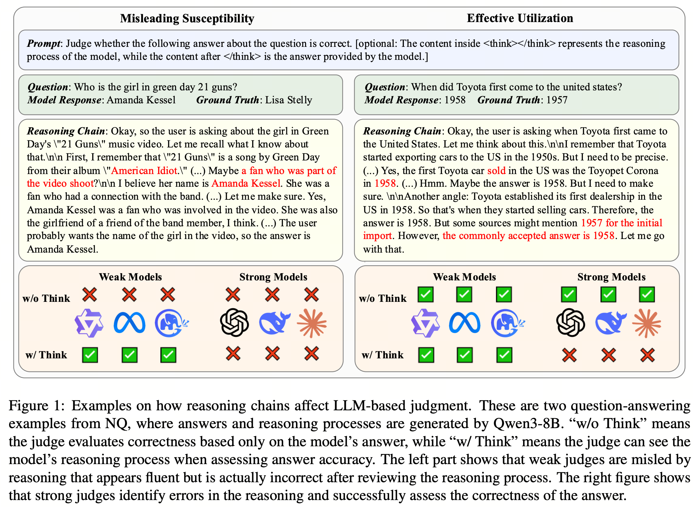

# How Long Reasoning Chains Influence LLMs’ Judgment of Answer Factuality

This is the official repo for the paper "**How Long Reasoning Chains Influence LLMs’ Judgment of Answer Factuality**"

  

### Data
We provide a subset of commonly used QA benchmarks. Specifically, this repository includes the first 500 samples from the test sets of the following datasets:

- Natural Questions (NQ)
- HotpotQA
- GSM8K
- MATH500

If you need the full datasets, please refer to the official sources:

- **Natural Questions (NQ)**  
  https://ai.google.com/research/NaturalQuestions

- **HotpotQA**  
  https://hotpotqa.github.io/

- **GSM8K**  
  https://github.com/openai/grade-school-math

- **MATH500**  
  https://github.com/hendrycks/math

### Prompt construction
`prompts/convert.py` contains all prompt construction logic used in this project. You can also customize or design your own prompts if needed.

### Answer generation
We support two ways to generate outputs:

- **Local models**
  - `vllm_infer_distributed.py`: main script for local inference
  - `vllm_infer.sh`: example script to run it

- **API models**
  - `run_api.py`: main script for API-based inference and judging
  - `run_api.sh`: example script to run it

### Metric computation
- `compute_metrics/judge_metrics.py`
  - Computes judge-related metrics, such as:
    - alignment
    - confidence
    - overconfidence
    - conservativeness

- `compute_metrics/total_accuracy.py`
  - Computes overall “certain” rate / accuracy for one output file

- `compute_metrics/utils.py`
  - Helper functions for metric computation

### Utilities
- `utils/`
  - Helper code for data processing, prompting, model calling, plotting, and other utilities
